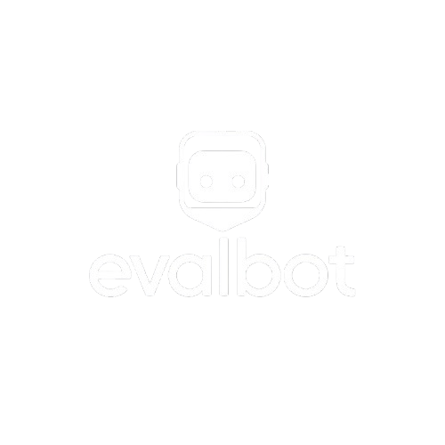

# Evalbot

Une application moderne de gestion d'examens avec correction automatique et détection de plagiat.

<div align="center">
  
</div>


## 📋 Table des matières

- [Fonctionnalités principales](#-fonctionnalités-principales)
- [Technologies utilisées](#-technologies-utilisées)
- [Installation](#-installation)
- [Configuration](#-configuration)
- [Utilisation](#-utilisation)
- [Architecture](#-architecture)
- [API Reference](#-api-reference)
- [Difficultés rencontrées](#-dépannage)

## 🚀 Fonctionnalités principales

- **Gestion des examens** : Création, modification et suppression d'examens pour les enseignants
- **Soumission de travaux** : Interface intuitive pour les étudiants
- **Détection de plagiat** : Système automatisé d'analyse des similitudes entre les soumissions
- **Correction automatique** : Évaluation assistée par IA des copies d'étudiants
- **Chatbot** : Chatbot alimentée par le modèle deepseek-r1:8b via Ollama

## 💻 Technologies utilisées

### Frontend
- **React** avec TypeScript
- **TailwindCSS** et **shadcn/ui** pour l'interface
- **React Query** pour la gestion d'état et requêtes API
- **Vite** comme outil de build

### Backend
- **Node.js** et **Express** 
- **PostgreSQL** pour la base de données
- **Multer** pour la gestion des téléchargements de fichiers
- **JSON Web Tokens** pour l'authentification

### IA et Analyse
- **Ollama** avec le modèle **deepseek-r1:8b**
- **pdf.js-extract** pour l'extraction de texte des PDFs
- Algorithme propriétaire de détection de plagiat

## 🔧 Installation

### Prérequis

- Node.js 18+
- PostgreSQL
- Ollama (pour l'assistant IA)

### Étapes d'installation

1. Cloner le dépôt
   ```bash
   git clone https://github.com/fmbaye09/Evalbot.git
   cd Evalbot
   ```

2. Installer les dépendances
   ```bash
   npm install
   ```

3. Configurer l'environnement
   ```bash
   cp .env.example .env
   # Modifier le fichier .env avec vos paramètres
   ```

4. Initialiser la base de données
   ```bash
   npm run db:reset
   npm run db:add-plagiarism
   ```

5. Installer Ollama et le modèle deepseek-r1:8b 
   ```bash
   # Installer Ollama depuis https://ollama.ai/download
   ollama pull deepseek-r1:8b
   ```

6. Démarrer l'application en mode développement
   ```bash
   npm run dev:server
   ```

## ⚙️ Configuration

### Variables d'environnement

Modifiez le fichier `.env` à la racine du projet avec les paramètres suivants :

```env
# Configuration de la base de données
DB_HOST=localhost
DB_PORT=5432
DB_NAME=examinateur_db
DB_USER=votre_utilisateur
DB_PASSWORD=votre_mot_de_passe

# Clé secrète pour JWT
JWT_SECRET=votre_cle_secrete_ici

# Configuration d'Ollama (serveur local)
VITE_OLLAMA_API_URL=http://localhost:11434
```

### Structure des dossiers

Dossiers pour le stockage des fichiers :

- `uploads/` - Dossier racine pour tous les fichiers
- `uploads/exams/` - Sujets d'examens
- `uploads/submissions/` - Copies soumises par les étudiants

## 🖥️ Utilisation

### Accès à l'application

- **Mode développement** : Accédez à l'application via `http://localhost:8084`
- L'API est disponible sur `http://localhost:3003`

### Rôles utilisateur

L'application prend en charge deux types d'utilisateurs :

1. **Enseignants** - Peuvent créer des examens, gérer les soumissions, donner une note
2. **Étudiants** - Peuvent consulter les examens disponibles et soumettre leurs travaux

### Workflow typique

#### Pour les enseignants :

1. Créer un compte avec le rôle "enseignant"
2. Créer un nouvel examen avec sujet au format PDF
3. Attendre les soumissions des étudiants
4. Corriger manuellement ou utiliser la correction automatique
5. Lancer l'analyse de plagiat si nécessaire
6. Consulter les statistiques et résultats

#### Pour les étudiants :

1. Créer un compte avec le rôle "étudiant"
2. Consulter les examens disponibles
3. Télécharger le sujet d'examen
4. Soumettre leur travail avant la date limite
5. Consulter leurs notes et feedback

## 🏗️ Architecture

### Structure de la base de données

Le schéma de base de données comprend les tables principales suivantes :

- `users` - Informations sur les utilisateurs
- `exams` - Détails des examens créés
- `submissions` - Soumissions des étudiants
- `corriges_types` - Corrigés types pour les examens
- `plagiarism_results` - Résultats de détection de plagiat

### Détection de plagiat

L'algorithme de détection de plagiat fonctionne en plusieurs étapes :

1. Extraction du texte des PDF soumis
2. Normalisation du texte (minuscules, suppression de la ponctuation)
3. Découpage en n-grammes (groupes de mots)
4. Calcul du coefficient de Jaccard pour mesurer la similarité
5. Identification des passages similaires

La formule utilisée est :
```
similarité = (taille de l'intersection / taille de l'union) * 100
```

### Assistant IA

L'assistant utilise Ollama pour:

- Générer des corrigés types à partir des sujets d'examen
- Évaluer les copies d'étudiants et suggérer des notes
- Répondre aux questions des utilisateurs en mode conversationnel

## 📚 API Reference

### Routes d'authentification

```
POST /api/auth/register     - Inscription
POST /api/auth/login        - Connexion
GET  /api/auth/me           - Profil utilisateur
```

### Routes d'examen

```
GET    /api/exams           - Liste des examens
POST   /api/exams           - Créer un examen
GET    /api/exams/:id       - Détails d'un examen
PUT    /api/exams/:id       - Modifier un examen
DELETE /api/exams/:id       - Supprimer un examen
```

### Routes de soumission

```
GET  /api/exams/:examId/submissions   - Liste des soumissions
POST /api/exams/:examId/submissions   - Créer une soumission
```

### Routes de correction

```
POST /api/correction/generate-corrige/:examId   - Générer un corrigé type
POST /api/correction/auto-grade/:submissionId   - Correction automatique
```

### Routes de plagiat

```
POST   /api/plagiarism/analyze/:examId    - Analyser le plagiat
GET    /api/plagiarism/results/:examId    - Résultats de plagiat
DELETE /api/plagiarism/results/:examId    - Supprimer les résultats
```

## 🔍 Difficultés Rencontrées


#### Problèmes avec Ollama (deepseek)
- Choix du modèle: les meilleurs modèles sont souvent trop volumineux
- Capacités: la machine doit être très puissante pour l'executer correctement

#### Fonctionnalité Notification en temps réel non implémentée
- difficultés à mettre en place cette fonctionnalité (problème technique).

#### Erreur de téléchargement de fichier
- Certains boutons "Télécharger" pour télécharger un fichier ne fonctionnent pas (à corriger).

#### Le Chatbot n'est pas alimenté avec les informations des examens
- L'etudiant pourrait l'utiliser pour avoir les réponses ...

### Reste à faire
- 

## 🤝 LA TEAM

- Mouhamed BA
- Mamadou DIALLO
- Mouhamadou Mourtada DIOP
- Babacar Mbaye FAYE
- Amadou Tidiane KANE
